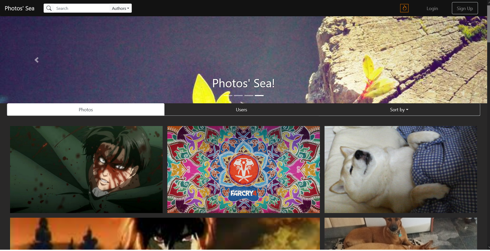
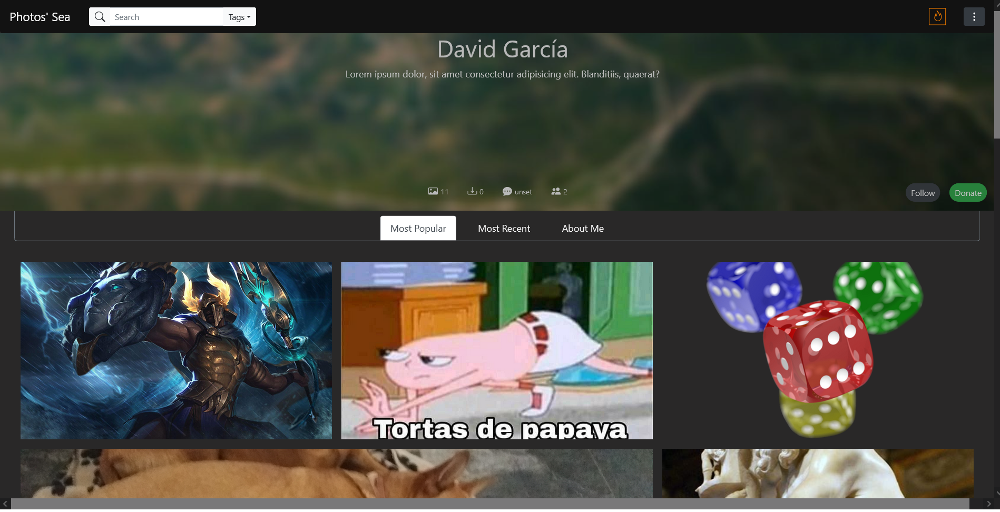
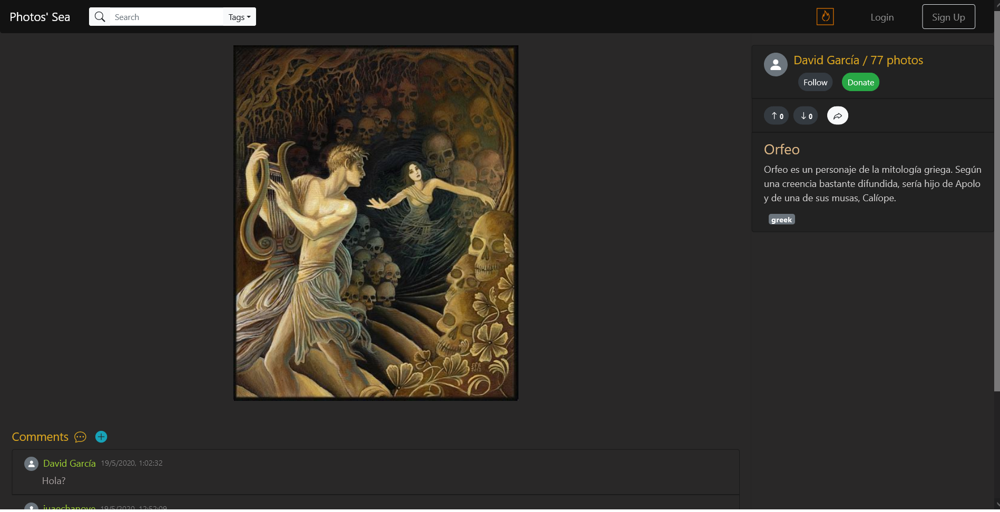

# photo-gallery

## Description
This is a simple photo gallery made for one of my university classes in 2020. It was deployed in Netlify as a full serverless web application.

You can upload, vote, or remove photos, add comments, login/sign-up with Google or with your email/password, search user/photos...

Used technologies:
- Vue (with TypeScript), Vuex.
- Firebase (Auth, Firestore, Storage)
- Bootstrap

## Screenshots
Home page:

Profile:

Photo details:

Login:

